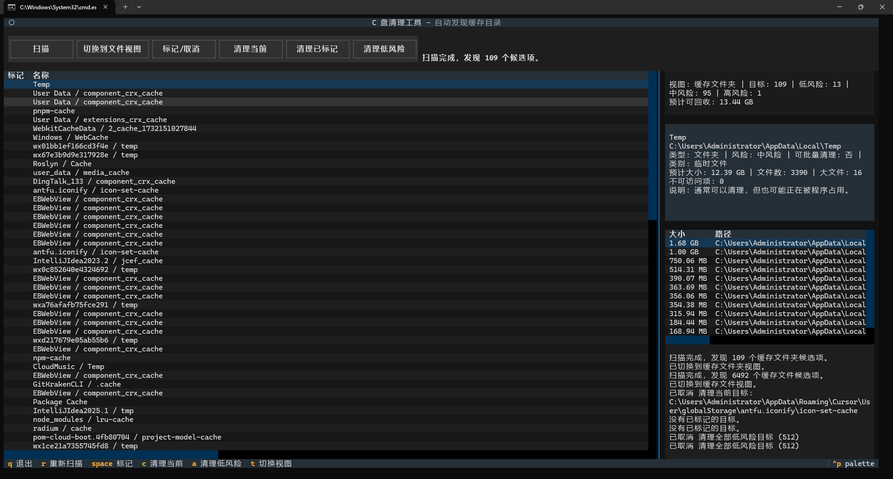

# C Drive Cleaner

一个面向 Windows 的交互式缓存清理工具，运行在终端界面中。它不会依赖一份固定的软件名单，而是自动发现系统中具有缓存特征的目录，帮助我们先看清空间占用，再决定清理什么。

## 界面预览



## 小白用户怎么用

如果你只是想直接运行软件，不想安装 Python，推荐使用已经打包好的 Windows 版本：

1. 打开 [Releases](https://github.com/wanxb/c-drive-cleaner/releases)
2. 下载最新版本里的 `c-drive-cleaner-windows.zip`
3. 解压压缩包
4. 进入解压后的文件夹
5. 双击运行 `c-drive-cleaner-dir.exe`
6. 进入界面后先点“扫描”，再优先使用“清理低风险”

说明：

- 不需要安装 Python
- 第一次运行如果被 Windows 提示安全确认，选择“仍要运行”即可
- 建议先扫描和查看，再清理

## 功能特性

- 自动扫描常见缓存目录并估算可回收空间
- 展示目录大小、文件数量、大文件数量与最大文件列表
- 默认按体积排序，优先处理最占空间的目录
- 支持一键清理低风险目标
- 支持只清理当前选中的目录
- 每次重新扫描时自动重新发现候选目录
- 支持在“缓存文件夹视图”和“缓存文件视图”之间切换
- 删除前可确认
- 清理时显示进度条
- 支持忽略规则与保留规则配置
- 删除失败时记录并分类原因

## 自动发现规则

默认会在 Windows 常见用户缓存根路径下递归发现目标，例如：

- `%LOCALAPPDATA%`
- `%APPDATA%`
- `%TEMP%`
- `C:\Windows\Temp`

只要目录名符合常见缓存特征，就会被自动纳入候选清理目标，例如：

- `cache`
- `caches`
- `code cache`
- `gpucache`
- `shadercache`
- `temp`
- `tmp`
- `crashdumps`
- 包含 `-cache`、`_cache`、`.cache` 等模式的目录名

因此像浏览器缓存、Electron 应用缓存、包管理器下载缓存这类目录，只要路径形态像缓存，就能被自动发现，而不需要为某个具体软件单独编写规则。

## 风险分级

扫描结果会自动分为三类：

- `LOW`：典型缓存目录，适合批量清理
- `MEDIUM`：临时目录或按模式命中的缓存目录，建议确认后清理
- `HIGH`：更接近安装包缓存等边界目录，只建议手动审查

其中 “Clean Low Risk” 只会处理 `LOW` 风险目标。

## 配置文件

首次运行会自动生成配置文件：

```text
%APPDATA%\c-drive-cleaner\config.json
```

当前支持这些配置项：

```json
{
  "confirm_before_clean": true,
  "whitelist_path_patterns": [],
  "ignored_path_patterns": [],
  "ignored_name_patterns": [],
  "ignored_risk_levels": [],
  "preserve_path_patterns": [],
  "preserve_name_patterns": []
}
```

常见用法：

- `whitelist_path_patterns`：只扫描命中的路径
- `ignored_name_patterns`：按目录名忽略，例如 `["package cache"]`
- `ignored_path_patterns`：按路径通配忽略，例如 `["*\\JetBrains\\*"]`
- `ignored_risk_levels`：忽略某类风险，例如 `["high"]`
- `preserve_path_patterns`：清理时保留命中的路径
- `preserve_name_patterns`：清理时保留命中的目录或文件名

示例：

```json
{
  "whitelist_path_patterns": ["*\\AppData\\Local\\Temp*", "*\\npm-cache*"],
  "preserve_path_patterns": ["*\\Temp\\keep-me*", "*\\Temp\\do-not-delete*"],
  "preserve_name_patterns": ["important-cache", "*.lock"]
}
```

## 开发者安装

如果你希望从源码运行，而不是下载发布版：

```bash
cd c-drive-cleaner
pip install -e .
```

要求：

- Python 3.11 或更高版本

## 开发者运行

启动 TUI：

```bash
c-drive-cleaner
```

或者：

```bash
python -m c_drive_cleaner
```

只做一次扫描并输出文本结果：

```bash
python -m c_drive_cleaner --scan-once
```

初始化默认配置：

```bash
python -m c_drive_cleaner --init-config
```

## TUI 操作

- `r`：重新扫描
- `space`：标记 / 取消标记当前目录
- `c`：清理当前选中目录
- `a`：一键清理全部低风险目录
- `t`：在缓存文件夹 / 缓存文件视图之间切换
- `q`：退出

界面按钮也支持相同操作。清理时右侧会显示当前进度、总数和正在处理的项目。

清理失败时，历史和界面会按原因分类显示，例如：

- `permission_denied`
- `in_use`
- `not_found`
- `path_too_long`
- `read_only`
- `unknown`

## License

MIT
